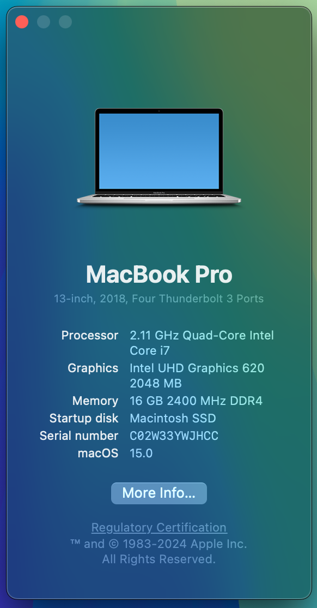

# OpenCore Hackintosh EFI for Lenovo ThinkPad T490
*Based on the OpenCore bootloader; off of the [OpenCorePkg](https://github.com/acidanthera/OpenCorePkg) made by [acidanthera](https://github.com/acidanthera) hosted on GitHub. Followed the [Dortania's OpenCore Install Guide](https://dortania.github.io/OpenCore-Install-Guide/) to get everything working from scratch for the best stability and compatibility! Make sure you also follow the [prequisites](#prequisites) and [UEFI settings](#biosuefi-settings)! If you find my work useful, please consider supporting me at [Ko-Fi](https://ko-fi.com/gamerboy1234294)❤️*

**WARNING/DISCLAIMER (VERY IMPORTANT)**: This EFI only supports running macOS Big Sur (11.x) to macOS Sequoia (15.x)! Also, bluetooth DOES NOT work starting from macOS Sequoia Public Beta 2/Developer Beta 4!

## Prequisites
If you don't have the T490 - Type 20N3 like me, make sure to disable "UTBMap.kext" in Config.plist and enable "UTBDefault.kext" instead. However, I highly reccomend you map the USB ports and generate a newly created "UTBMap.kext" with the help of [USBToolbox](https://github.com/USBToolBox/tool/releases/latest) instead! In order for Wi-Fi to work on macOS Sequoia (15), you MUST download & install an application named HeliPort.dmg from the [HeliPort](https://github.com/diepeterpan/HeliPort/releases/latest) GitHub repository (I have updated the link to a more stable version, so update to that if you already haven't done so). It is also recommended that you install the latest release version of an app named YogaSMC from the [YogaSMC](https://github.com/zhen-zen/YogaSMC/releases/latest) GitHub repository. Double click the "YogaSMCPane.prefPane" file in the "YogaSMC-App-Release.dmg" file and drag the "YogaSMCNC.app" file to "Applications" folder. ~~If you are thinking of using a macOS version before Ventura 13.3; replace the boot-arg "-igfxblt" with "-igfxblr" in **NVRAM/Add/7C436110-AB2A-4BBB-A880-FE41995C9F82/boot-args**.~~ (no need for that anymore!)

## My Specifications/Specs

| | |
|-|-|
|**Type**|20N3
|**CPU**|Intel® Core™ i7-8665U Processor @ 1.9GHz (Whiskey Lake)|
|**RAM**|16GB DDR4 2400MHz|
|**iGPU**|Intel® UHD Graphics 620|
|**SSD**|NVMe M.2 AGI512GIMAI298 512GB SSD|
|**WLAN+BT**|Intel® Wireless-AC 9560 (A BCM card natively supported by real Macs will work more stable)|
|**Audio**|Realtek ALC3287 (ALC257 codec)|
|**Ports**|2xUSB3.0 Type-A, 2xThunderbolt 3, HDMI, Micro SD card reader, and Headphone Jack|
|**OpenCore Bootloader**|V1.0.1 MOD (Will constantly be updated, including the kexts/drivers, so all you have to do is come back after a month or so and look for a commit along the lines of "Updated OpenCore to X.X.X MOD!" or check the latest release for something like that)

## BIOS/UEFI Settings

After powering on the machine, spam <kbd>F1</kbd> until you hear a beep to enter the BIOS. Change the following settings:

Category | Setting
:-------:|------------
**Config** | **Display** <ul> <li>Shared Display Priority: `HDMI` <li> Total Graphics Memory: `256 MB` </ul> **CPU** <ul> <li> Intel Hyperthreading Technology: `ON` 
**Security** | **Fingerprint** <ul><li>Predesktop Authentication: `OFF` </ul> **Security Chip** <ul><li>Security Chip`ON` or `OFF` (enable for Windows 11) </ul> **Memory Protection** <ul> <li> Execution Prevention: `ON`</ul></ul> **Virtualization** <ul><li> Kernel DMA Protection: `ON` (enables `VT-D` by design)</ul> **I/O Port Access** <ul> <li> Ethernet LAN: `ON` <li> Wireless LAN: `ON` <li> Bluetooth: `ON` <li> USB Port: `ON` <li> Memory Card Slot: `ON` <li> Smart Card Slot: `OFF` <li> Integrated Camera: `ON` <li> Integrated Audio: `ON` <li> Microphone: `ON` <li> Fingerprint Reader: `ON` (works in Windows only) or `OFF` <li> Thunderbolt 3: `ON` </ul> **Absolute Persistance Module** <ul><li> Absolute Persistance Module Activation: `Disabled`</ul> **Secure Boot Configuration** <ul><li> Secure Boot: `OFF` </ul> **Intel SGX** <ul><li> Intel SGX Control: `Disabled`
**Startup** | <ul> <li> **UEFI/Legacy Boot**: `UEFI Only` <li> **Boot Mode**: `Quick` (Skips Diagnostics)

## Not Working

- You tell me?!

## Working

- **Everything else that is not in the Not Working section :D**
- Bluetooth (works natively on all macOS)
- WLAN (works natively on all macOS except Sequoia; read [this section](#prequisites) for easy instructions on how to fix for macOS Sequoia (15).
- USB ports mapped precisely (working after sleep)
- Thunderbolt (should work, as I have NOT tested it)
- Synaptics SMBus Trackpad with fully working gestures (using VoodooSMBus, VoodooPS2, and VoodooRMI)
- Audio (and the keys for it), with speaker, microphone, and headphone jack support
- Graphics Acceleration (QI/CI)
- Sleep
- Micro SDHC/SDXC card reader
- Brightness (and the keys for it)
- Touchscreen (if you don't have one, make sure you know how to map USB ports [here](#prequisites))
- Sidecar (Continuity and Handoff work too)
- Hibernation (it is working now!)

## Conclusion

In conclusion, I hope there are no issues to your very own hackintosh quest. If there are problems or just want me to improve something; creating pull requests or issues are welcome! :)
