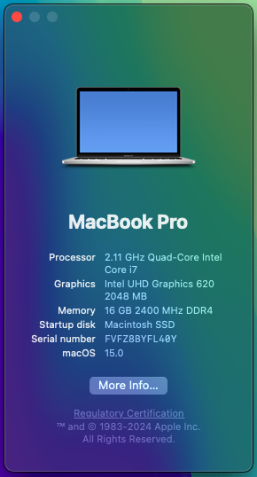

# OpenCore Hackintosh EFI for Lenovo ThinkPad T490
*Based on the OpenCore bootloader; off of the [OpenCorePkg](https://github.com/acidanthera/OpenCorePkg) made by [acidanthera](https://github.com/acidanthera) hosted on GitHub. Followed the [Dortania's OpenCore Install Guide](https://dortania.github.io/OpenCore-Install-Guide/) to get everything working from scratch for the best stability and compatibility! Make sure you also follow the [prequisites](#prequisites)! If you find my work useful, please consider supporting me at [Ko-Fi](https://ko-fi.com/gamerboy1234294)❤️*

**WARNING/DISCLAIMER (VERY IMPORTANT)**: This EFI only supports running macOS Big Sur (11) to macOS Sequoia (15)!

# Prequisites
If you don't have a touchscreen T490 and/or not the same T490 - Type 20N3 as me, make sure to disable "UTBMap.kext" in Config.plist and enable "UTBDefault.kext" instead. However, I highly reccomend you map the USB ports and generate a newly created "UTBMap.kext" with the help of [USBToolbox](https://github.com/USBToolBox/tool/releases/latest) instead! In order for Wi-Fi to work on macOS Sequoia (15), you MUST download & install an application named HeliPort.dmg from the [HeliPort](https://github.com/OpenIntelWireless/HeliPort/releases/latest) GitHub repository. It is also recommended that you install the latest release version of an app named YogaSMC from the [YogaSMC](https://github.com/zhen-zen/YogaSMC/releases/latest) GitHub repository. Double click the "YogaSMCPane.prefPane" file in the "YogaSMC-App-Release.dmg" file and drag the "YogaSMCNC.app" file to "Applications" folder.

## My Specifications/Specs

| | |
|-|-|
|**Type**|20N3
|**CPU**|Intel® Core™ i7-8665U Processor @ 1.9GHz (Whiskey Lake)|
|**RAM**|16GB DDR4 2400MHz|
|**iGPU**|Intel® UHD Graphics 620|
|**SSD**|NVMe M.2 AGI512GIMAI298 512GB SSD|
|**WLAN+BT**|Intel® Wireless-AC 9560 (A BCM card natively supported by real Macs will work more stable)|
|**Audio**|Realtek ALC3287 (ALC257 codec)|
|**Ports**|2xUSB3.0 Type-A, 2xUSB Type-C, HDMI, Micro SD card reader, Headphone Jack, and Thunderbolt charging port|
|**OpenCore Bootloader**|V1.0.1 MOD (Will constantly be updated, including the kexts/drivers, so all you have to do is come back after a month or so and look for a commit along the lines of "Updated OpenCore to X.X.X MOD!" or check the latest release for something like that)

## Not Working

- Hibernation (won't cause a problem though, as I disabled it in OpenCore)
- You tell me?!

## Working

- **Everything else that is not in the Not Working section :D**
- Bluetooth (works natively on all macOS)
- WLAN (works natively on all macOS except Sequoia; read [this section](#prequisites) for easy instructions on how to fix for macOS Sequoia (15).
- USB ports mapped precisely (working after sleep)
- Thunderbolt (should work, as I have NOT tested it)
- Synaptics SMBus Trackpad with fully working gestures (using VoodooSMBus, VoodooPS2, and VoodooRMI)
- Audio (and the keys for it), with speaker, microphone, and headphone jack support
- Graphics Acceleration (QI/CI)
- Sleep
- Micro SDHC/SDXC card reader
- Brightness (and the keys for it)
- Touchscreen (if you don't have one, make sure you know how to map USB ports [here](#prequisites))
- Sidecar (Continuity and Handoff work too)

## Conclusion

In conclusion, I hope there are no issues to your very own hackintosh quest. If there are problems or just want me to improve something; creating pull requests or issues are welcome! :)
